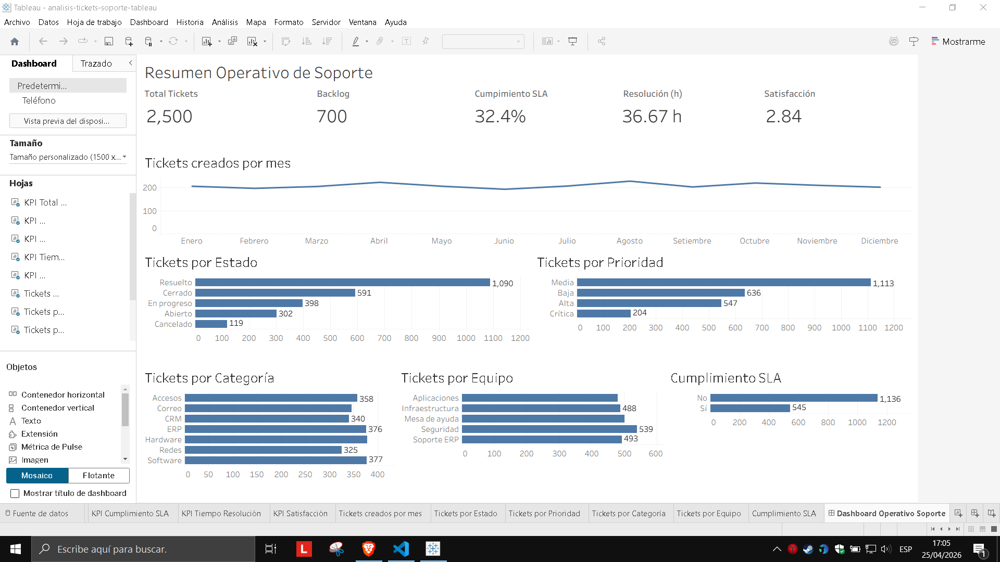

# Análisis Operativo de Tickets de Soporte con Tableau

Proyecto de análisis de datos orientado a monitorear el desempeño operativo de un área de soporte tecnológico mediante un dashboard interactivo en Tableau.

## Empresa ficticia

**AndinaTech Services S.A.C.**

Empresa ficticia dedicada a brindar soporte tecnológico a clientes internos y externos.

## Caso de negocio

AndinaTech Services S.A.C. recibe tickets de soporte por distintos canales, categorías, prioridades y equipos de atención.  
Debido al crecimiento del volumen de tickets, la gerencia necesita una solución visual que permita monitorear el estado de la operación, medir el cumplimiento de SLA, identificar backlog y analizar los tiempos de resolución.

## Objetivo del proyecto

Construir un dashboard en Tableau que permita analizar:

- Volumen total de tickets.
- Tickets abiertos, en progreso, resueltos y cerrados.
- Cumplimiento de SLA.
- Tickets vencidos.
- Backlog operativo.
- Tiempo promedio de resolución.
- Satisfacción promedio del cliente.
- Carga de tickets por equipo, categoría, prioridad y canal.
- Tendencia mensual de tickets.

## Dashboard

Vista principal del dashboard operativo desarrollado en Tableau:



## Herramientas utilizadas

- Python
- Pandas
- Tableau
- CSV
- Git / GitHub

## Estructura del proyecto

```text
analisis-tickets-soporte-tableau/
│
├── data/
│   ├── raw/
│   │   └── tickets_soporte_raw.csv
│   └── processed/
│       └── tickets_soporte.csv
│
├── scripts/
│   ├── generar_dataset_tickets.py
│   └── revisar_dataset.py
│
├── tableau/
│
├── docs/
│   └── capturas/
│
├── README.md
└── .gitignore
```

## Dataset

El dataset fue generado de forma sintética con Python y contiene **2500 tickets de soporte** correspondientes al periodo **enero a diciembre de 2025**.

Las columnas principales son:

- ticket_id
- fecha_creacion
- fecha_cierre
- canal
- prioridad
- categoria
- subcategoria
- estado
- equipo_asignado
- agente
- cliente_empresa
- ciudad
- tipo_cliente
- sla_horas
- tiempo_resolucion_horas
- cumple_sla
- dias_abierto
- satisfaccion_cliente

## Métricas principales

- Total de tickets.
- Tickets resueltos.
- Tickets abiertos.
- Backlog.
- Tickets vencidos.
- Porcentaje de cumplimiento de SLA.
- Tiempo promedio de resolución.
- Satisfacción promedio.
- Tickets por prioridad.
- Tickets por canal.
- Tickets por categoría.
- Tickets por equipo.

## Estado del proyecto

En desarrollo.

## Autor

**Alexis Suasnabar**
